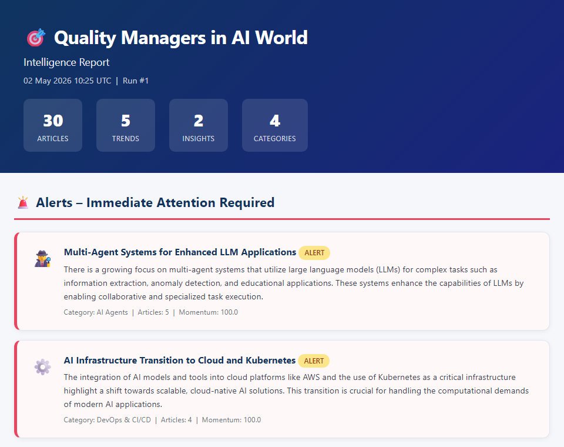
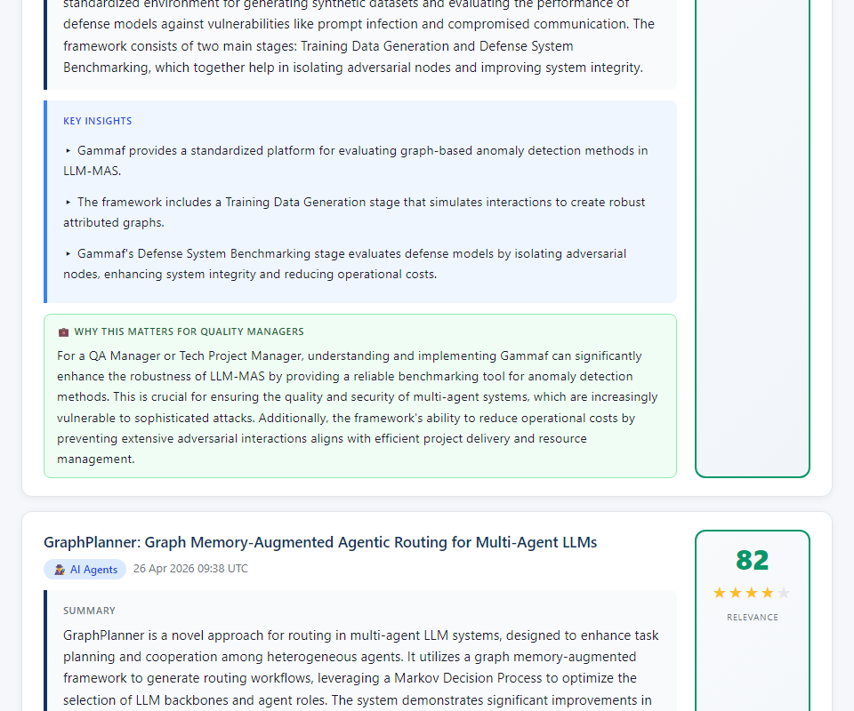
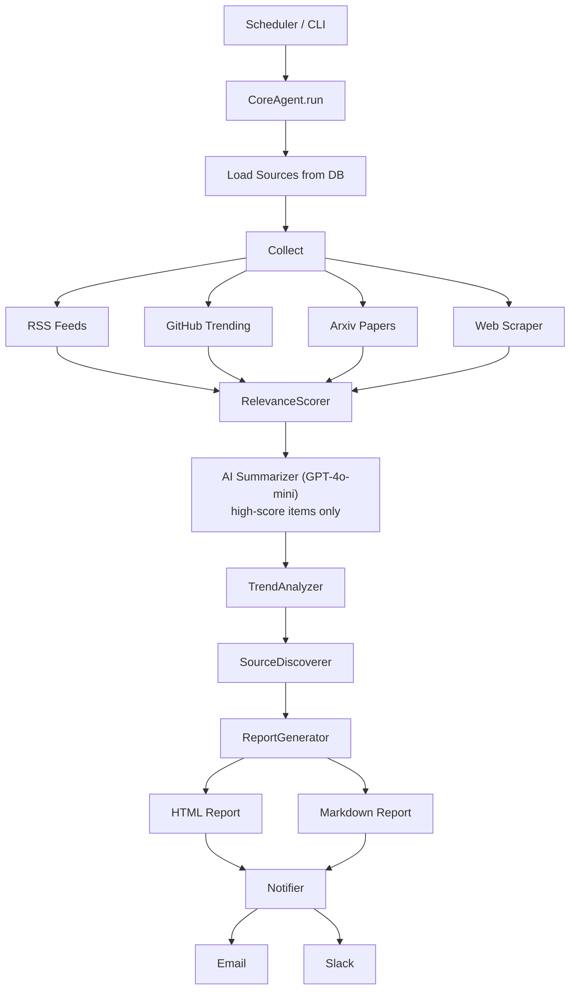

# Quality Manager Intelligence Agent

[](https://github.com/royavrahami/quality-manager-intelligence-agent/actions/workflows/agent.yml)
[](LICENSE)
[](https://python.org)

An autonomous agent that continuously monitors the GenAI, AI Agents, software testing, and developer tools landscape — then delivers structured, actionable intelligence reports tailored for **QA Managers** and **Tech Project Managers** in the high-tech industry.

---

## Tech Stack

| Layer | Technology |
|---|---|
| **Language** | Python 3.11+ |
| **LLM** | OpenAI GPT-4o / GPT-4o-mini |
| **Database** | SQLAlchemy ORM — SQLite (local) or PostgreSQL (production) |
| **Scheduling** | APScheduler |
| **Templating** | Jinja2 (HTML reports) |
| **Config** | pydantic-settings + `.env` |
| **Notifications** | SMTP (email) + Slack Web API |
| **Containerisation** | Docker + Docker Compose |
| **Testing** | pytest + pytest-cov |

---

## Report Preview

| Dashboard & Alerts | Top Articles with AI Summaries |
|---|---|
|  |  |

---

## What It Does

| Capability | Details |
|---|---|
| **Web intelligence** | Polls 30+ curated RSS feeds, GitHub Trending, Arxiv papers, and web sources every 6 hours |
| **AI-powered analysis** | Uses OpenAI GPT-4o-mini to summarise every article and extract QA-specific insights |
| **Trend detection** | Clusters articles into trends, calculates momentum scores, and raises alerts for rapidly accelerating themes |
| **Self-expansion** | Discovers new information sources autonomously by mining article pages for RSS feeds and querying the LLM for recommendations |
| **Rich reports** | Generates beautiful HTML + Markdown reports organised by category, relevance score, trend landscape |
| **Notifications** | Sends alerts via Email (SMTP) and Slack when high-momentum trends are detected |

---

## Quick Start

### Mac / Linux

```bash
git clone <repo-url> && cd qa-intelligence-agent
bash setup.sh          # creates .venv, installs deps, prompts for API key
python3 main.py run    # first run – generates a report
```

### Windows

```bat
git clone <repo-url> && cd qa-intelligence-agent
setup.bat              :: creates .venv, installs deps, creates run.bat
run.bat run            :: first run – generates a report
```

> **Windows note:** `run.bat` sets `PYTHONNOUSERSITE=1` automatically.
> This prevents Windows Store Python stub modules from shadowing venv
> packages (a known issue on Windows 10/11 when the Windows Store Python
> app is installed). If you run `python main.py run` directly without
> this flag and get an `ImportError`, add `set PYTHONNOUSERSITE=1` to
> your terminal session first.

### Manual setup (any OS)

```bash
cd qa-intelligence-agent
cp .env.example .env
# Edit .env – set OPENAI_API_KEY=sk-...

python -m venv .venv
source .venv/bin/activate          # Windows: .venv\Scripts\activate
pip install -r requirements.txt
python main.py run
```

### 4. Start the scheduler (runs every 6 hours)

```bash
python main.py schedule
```

### 5. View reports

Reports are saved to `./reports/` as HTML files. Open in any browser.

---

## CLI Commands

```bash
python main.py run                   # Single run and exit
python main.py schedule              # Start recurring scheduler
python main.py schedule --interval 3 # Override interval (hours)
python main.py report                # Generate report from existing data
python main.py status                # Show run history
python main.py sources               # List all registered sources
```

---

## Docker Deployment

```bash
cp .env.example .env     # Fill in OPENAI_API_KEY
docker compose up -d     # Start in background
docker compose logs -f   # Watch logs

# One-shot run (useful in CI pipelines)
docker compose --profile run-once up qa-agent-run-once
```

---

## Configuration

All settings are via environment variables (`.env` file):

| Variable | Default | Description |
|---|---|---|
| `OPENAI_API_KEY` | **required** | OpenAI API key |
| `OPENAI_MODEL` | `gpt-4o` | Model for summarisation and trend analysis (`gpt-4o-mini` for lower cost) |
| `GITHUB_TOKEN` | optional | GitHub PAT (raises API rate limit from 60 → 5000 req/hr) |
| `SCHEDULE_INTERVAL_HOURS` | `6` | How often the agent runs |
| `MIN_RELEVANCE_SCORE` | `50` | Minimum score (0–100) to include an article in reports (lower = more articles, higher OpenAI cost) |
| `NOTIFY_EMAIL` | optional | Email address to send alert notifications to |
| `SLACK_BOT_TOKEN` | optional | Slack bot token for channel notifications |
| `SLACK_CHANNEL` | `#qa-intelligence` | Slack channel to post to |

---

## Report Structure

Each generated report contains:

1. **Executive Stats** – Articles collected, trends detected, alerts count
2. **🚨 Alerts** – Trends requiring immediate attention (momentum ≥ threshold)
3. **⭐ Top 10 Articles** – Highest relevance score, with AI summary + insights + QA relevance
4. **📂 Articles by Category** – All articles grouped by: GenAI, AI Agents, QA & Testing, DevOps, Tools, Project Management
5. **📈 Trend Landscape** – All detected trends with momentum bars and descriptions

---

## Monitored Sources (default)

| Category | Sources |
|---|---|
| GenAI & LLMs | OpenAI Blog, Anthropic, Google AI Blog, Hugging Face, The Batch (DeepLearning.AI) |
| AI Agents | LangChain Blog, Simon Willison's Blog, Import AI |
| QA & Testing | Ministry of Testing, Test Automation University, Google Testing Blog, Applitools Blog |
| DevOps | Martin Fowler, The New Stack, DevOps.com |
| Tools | Hacker News, GitHub Blog, Dev.to, GitHub Trending |
| Academic | Arxiv (AI Agents, Software Testing + LLMs, GenAI Test Automation, RAG, Multi-Agent Systems) |

New sources are **discovered automatically** every run and added to the database.

---

## Architecture

```
qa-intelligence-agent/
├── src/
│   ├── agent/           # CoreAgent orchestrator, TrendAnalyzer, SourceDiscoverer
│   ├── collectors/      # RSS, GitHub, Arxiv, Web scrapers
│   ├── processors/      # RelevanceScorer, Summarizer, ContentProcessor
│   ├── storage/         # SQLAlchemy models + repositories (SQLite/PostgreSQL)
│   ├── reports/         # HTML/Markdown report generator + Jinja2 templates
│   ├── notifications/   # Email (SMTP) + Slack notifier
│   ├── scheduler/       # APScheduler wrapper
│   └── config/          # Settings (pydantic-settings) + sources.yaml
├── tests/               # Pytest suite (one class per file)
├── reports/             # Generated HTML reports
├── data/                # SQLite database
└── main.py              # CLI entry point
```

### Execution Cycle



---

## Running Tests

```bash
pytest                        # Run all tests with coverage
pytest -m "not integration"   # Skip tests that need network
pytest tests/test_storage/    # Run a specific module
```

### Example Test Output

```
========================= test session starts =========================
collected 102 items

tests/test_agent/test_trend_analyzer.py .............             [ 12%]
tests/test_collectors/test_rss_collector.py ......                [ 18%]
tests/test_notifications/test_notifier.py ........               [ 26%]
tests/test_processors/test_content_processor.py ..               [ 28%]
tests/test_processors/test_keyword_extractor.py ..........        [ 38%]
tests/test_processors/test_relevance_scorer.py ..........         [ 48%]
tests/test_processors/test_summarizer.py ........                 [ 55%]
tests/test_reports/test_daily_digest_generator.py ............    [ 67%]
tests/test_reports/test_report_generator.py ..........            [ 77%]
tests/test_storage/test_database.py ...                           [ 80%]
tests/test_storage/test_repository.py ....................        [100%]

---------- coverage: platform, python 3.12 -----------
TOTAL                                    2038   1037    49%

========================= 102 passed in 7.27s =========================
```

> Coverage currently concentrates on the scoring, summarisation, reporting
> and storage core. Broadening unit coverage to the collector, scheduler and
> notification layers is tracked in the roadmap.

---

## Adding New Sources

**Option A – Edit `src/config/sources.yaml`:**

```yaml
rss_feeds:
  - name: "New Blog"
    url: "https://newblog.com/feed"
    category: "genai"
    relevance_boost: 10
```

**Option B – The agent will discover them automatically** based on article links and LLM recommendations.

---

## Extending the Agent

To add a new collector (e.g. LinkedIn, YouTube, Jira changelog):
1. Create `src/collectors/my_collector.py` with a class following the same interface as `RSSCollector`
2. Register the call in `CoreAgent._collect()`
3. Add tests in `tests/test_collectors/test_my_collector.py`

---

## Limitations & Next Steps

**Current limitations:**
- Report generation requires an active OpenAI API key (no offline fallback)
- Source discovery quality depends on GPT responses — occasionally suggests irrelevant feeds
- No deduplication across very similar articles from different sources

**Planned improvements:**
- [ ] Web UI dashboard (replace static HTML reports)
- [ ] Vector-based semantic deduplication
- [ ] Support for additional LLM providers (Anthropic Claude, Gemini)
- [ ] Slack slash-command to trigger on-demand reports
- [ ] Multi-workspace configuration (one agent, multiple topic profiles)

---

## License

MIT
